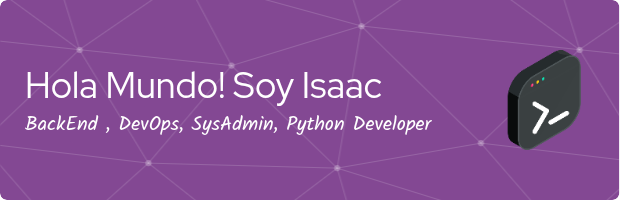

---

  

# 👋 Bienvenido a mi perfil de GitHub 
- Si quieres ver directamente mis proyectos de manera organizada pincha aqui [INDEX](https://isaccwebdev.github.io/indexprojects/)
- Mis avances en el campo de DevOps: [Pincha Aqui](https://isaacs-web-dev.gitbook.io/isaacs-docs/)

## Conéctate conmigo

- **LinkedIn**: [Tu perfil de LinkedIn](#)
- **Correo Electrónico**: [tu_correo@example.com](mailto:tu_correo@example.com)
- **Twitter**: [@tu_usuario](#)
- **Github GIST**: [Isaccwebdev](https://gist.github.com/isaccwebdev)
---

## Sobre mí

Soy un **administrador de servidores** y **programador Python** con una pasión por la tecnología y la automatización. Con varios años de experiencia en la gestión de infraestructuras de TI, mi objetivo es crear soluciones eficientes y seguras para diversos problemas técnicos. Disfruto trabajando en proyectos que involucran la administración de servidores, scripting, y el desarrollo backend. Actualemente me encuentro como DevOps Junior.

## 🛠 Herramientas y Tecnologías

### Lenguajes de Programación:
- **Python**: Mi lenguaje principal para el desarrollo de scripts y aplicaciones backend.
- **Bash**: Utilizado para la automatización de tareas en sistemas Unix.
- **SQL**: Para la gestión y consulta de bases de datos.

  
  
  
  
  
  
  
  
  
  

### Sistemas Operativos:
- **Linux**: Principalmente distribuciones como Ubuntu Server, y distros como Red Hat para la administración de servidores.
- **Windows Server**: Experiencia en la administración y configuración.

  
  
  

### Herramientas de Desarrollo y Administración:
- **Docker**: Contenerización de aplicaciones para desarrollo y despliegue.
- **Ansible**: Automatización de la configuración y gestión de servidores.
- **Git**: Control de versiones para gestionar el código fuente.
- **Jenkins**: Integración continua y despliegue continuo (CI/CD).
- **Nginx y Apache**: Configuración y mantenimiento de servidores web.
- **MySQL y PostgreSQL**: Administración y optimización de bases de datos.

   
  
  
  
  
  
  
  
  
  
  
  
  
  
  
  
  
  
  
  
  
  
  
  
  
  
  
  
  
  

### Tecnologías en la Nube:
- **AWS**: Experiencia en servicios como EC2, S3, RDS y Lambda
- **AZURE**
- **GCP**

  
  
  
  
  

## Estadísticas de GitHub

  
